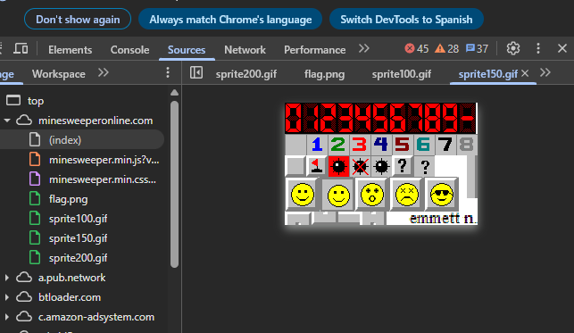
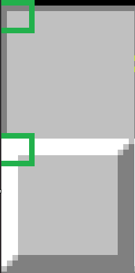
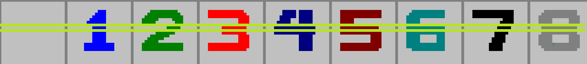
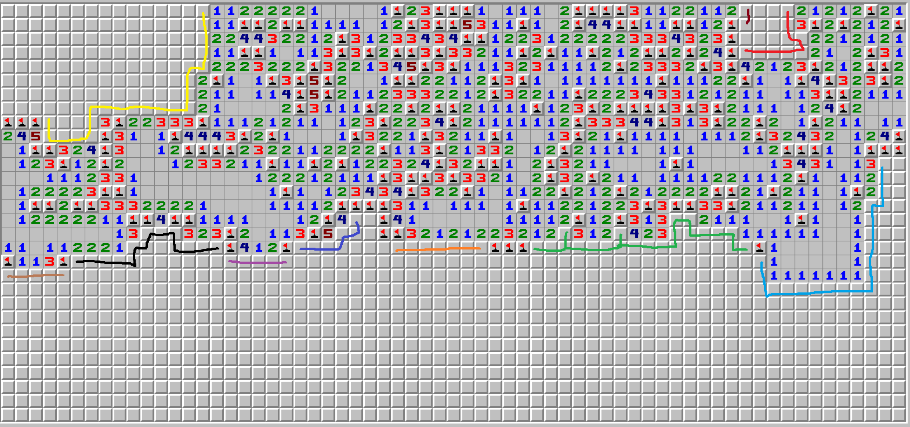

# 🧨 Buscaminas en Python

## 📌 Descripción

Este proyecto consiste en crear un bot para jugar automáticamente al clásico juego del **Buscaminas**. Existen **dos versiones del programa**:

- Una versión **completa y funcional**, ubicada en el directorio principal, que utiliza la biblioteca **PyAutoGUI**.
- Una versión **incompleta**, ubicada en un subdirectorio, que fue desarrollada inicialmente con **Selenium**.

## 🚀 Motivación y evolución

Comencé desarrollando el bot con Selenium. Conseguí hacer la primera fase que es identificar las minas y hacer clic en las casillas seguras. Sin embargo, el rendimiento era muy lento, así que busqué alternativas más rápidas. Fue entonces cuando descubrí **PyAutoGUI**, que resultó ser mucho más eficiente para este caso.

---

## 🧪 Versión con Selenium

Esta versión necesita un **driver de Chrome**. Al ejecutar el programa, se abre una ventana del navegador con un mensaje que indica que está siendo automatizado. Esto puede ser un inconveniente en páginas que bloquean la automatización y es algo para tener en cuenta en proyectos futuros.

### ❌ Limitaciones

- Selenium carga todos los elementos de la página (HTML, CSS...), lo cual lo hace **muy lento**.
- Cada vez que se hace clic en una casilla segura, la página se **recarga parcialmente**, haciendo el proceso más pesado.
- En mis pruebas:
  - El nivel **principiante** se resolvía en unos **7 segundos**.
  - El nivel **intermedio** en aproximadamente **18 segundos**.
  - Esto es **demasiado lento** para un bot eficiente.

### ✅ Ventajas

- Al trabajar directamente con los elementos del **DOM**, Selenium permite una mayor **flexibilidad** en cuanto a resolución de pantalla, posición de los elementos y precisión en la interacción.
- Los elementos del juego son **fáciles de identificar** gracias a sus clases e identificadores bien estructurados.

### 🧾 Datos del DOM del Buscaminas

Al inspeccionar el HTML del juego, es posible identificar con facilidad la información relevante de cada casilla. Por ejemplo:

- La **clase (`class`)** indica el **estado de la casilla** (en blanco, descubierta, número de minas cercanas, etc.).
- El **identificador (`id`)** proporciona la **posición** de la casilla en formato `fila_columna`.

#### Ejemplos de casillas:

- **Casilla en blanco**, sin descubrir. Podría contener una mina.  
  (x = 20, y = 8)  
  ```html
  <div class="square blank" id="8_20"></div>
  ```

- **Casilla descubierta con el número 2**, lo que indica que hay dos minas alrededor.  
  (x = 16, y = 7)  
  ```html
  <div class="square open2" id="7_16"></div>
  ```

### 🎮 Estado de la partida

También es posible detectar el **estado del juego** (en curso, ganado o perdido) a través de un elemento del DOM con identificador `"face"` y una clase que cambia dinámicamente:

- Si la clase es `"facesmile"`, significa que la partida **sigue activa**.  
  ```<div class="facesmile" style="margin-left:182px; margin-right: 182px;" id="face"></div>```

### 📋 Resumen de clases útiles

| Clase              | Significado                             |
|-------------------|------------------------------------------|
| `square blank`       | Casilla no descubierta (posible mina)    |
| `square open0`       | Casilla descubierta, 0 minas alrededor   |
| `square open1`       | Casilla descubierta, 1 mina alrededor    |
| `square open2`       | Casilla descubierta, 2 minas alrededor   |
| `square open3`       | Casilla descubierta, 3 minas alrededor   |
| `square open4`       | Casilla descubierta, 4 minas alrededor   |
| `square open5`       | Casilla descubierta, 5 minas alrededor   |
| `square open6`       | Casilla descubierta, 6 minas alrededor   |
| `square open7`       | Casilla descubierta, 7 minas alrededor   |
| `square open8`       | Casilla descubierta, 8 minas alrededor   |
| `square bombflagged` | Casilla marcada con posible bomba           |
| `facesmile`          | Partida en curso                         |
| `facewin`            | Has ganado                               |
| `facedead`           | Has perdido                              |

---

## 🧪 Versión con PyAutoGUI (versión final)

Esta versión no necesita interactuar con el navegador ni analizar el DOM. En su lugar, **actúa directamente sobre capturas de pantalla** y analizando los **píxeles** de la imagen o interactuando con los píxeles de tu pantalla. El bot actúa como si fuera un usuario.

### ❌ Limitaciones

- Aunque PyAutoGUI permite buscar **patrones visuales** o imágenes dentro de la pantalla, cuanto **más amplia** es la zona que analizas, **más lento** será el proceso.
- Si usas **valores de píxeles exactos**, el sistema es muy rápido, pero pierde flexibilidad. Si la página se desplaza incluso **un solo píxel**, el bot puede dejar de funcionar.
- Cuanta más **precisión** exijas, menor será el **margen de error** permitido.
- Es necesario hacer una especie de **"data mining" manual** para identificar qué píxeles o colores te interesa capturar y qué significan. Es decir, tú defines tus propios datos a partir de la imagen.

### ✅ Ventajas

- Usando coordenadas y colores de **píxeles exactos**, el bot es **extremadamente rápido**.
- Permite un mayor **margen de optimización** que Selenium.
- Al hacer clic, **no es necesario recargar la página** ni esperar ninguna transición.
- En mis pruebas:
  - El nivel **principiante** se resolvía en aproximadamente **1 segundo**.
  - El nivel **intermedio** en unos **3 segundos**.
  - El nivel **experto** en unos **10 segundos**.
  - Estos tiempos son **muy superiores** a los que obtuve usando Selenium.

### 📊 Datos de ejemplo

A diferencia de Selenium, aquí los datos **los defines tú** a partir de lo que ves en pantalla. Por ejemplo:
```python
config.x_victory = 446 - config.screenshot_left
```  

Este valor (`x_victory`) representa la posición horizontal (coordenada X) del píxel donde se muestra la **cara de victoria**. Lo calculada en base al desplazamiento del área capturada.

Otro ejemplo:
```python
(255, 0, 0): 3
``` 

Esto indica que el color **rojo puro** `(255, 0, 0)` representa el número **3** en el tablero. Es una forma directa de identificar qué número aparece en una casilla, a raíz del color de un pixel.

Como se puede ver, esta técnica requiere definir manualmente los valores relevantes, pero te da un **control total** sobre cómo interpretar la imagen. Puedes usar la función `show` para ver la captura o guardarla y usar el propio paint para medir y obtener las distancias de los pixeles más relevantes.

### 🧾 Conclusión

Aunque **PyAutoGUI** no tolera errores y requiere realizar **pruebas manuales** para identificar los píxeles y extraer los datos útiles, ofrece un rendimiento **mucho más rápido** que Selenium.

Es una herramienta muy eficaz cuando se prioriza la **velocidad de ejecución** y el **control total** sobre el entorno, a cambio de una menor tolerancia a cambios visuales y más trabajo inicial de configuración.

---

## 🧪 Detección de píxeles y extracción de datos

En el apartado `sources` se encuentran los distintos iconos que la página usa para representar cada elemento del tablero. Esto es muy útil para analizar los píxeles y decidir qué información buscar.



Una vez recopilados, el siguiente paso es **analizar los elementos y dividirlos al máximo**, con el objetivo de reducir comprobaciones y generalizar el proceso lo más posible.

### 🟨 Al principio

Recortaba cada imagen directamente desde la imagen que me daba la página para comparar los patrones completos. Funcionaba, pero resultaba lento y poco eficiente.
Investigando, descubrí que podía optimizar la búsqueda analizando solo píxeles clave y no imagenes, porque al final una imagen 24x24 son 576 pixeles cada vez.

### ✂️ Mi división

La primera separación que hice fue distinguir entre:

- El tablero de minas
- El cuadro del smile

### 🔲 Casillas

Con el zoom al **150%**, cada casilla ocupa **24×24 píxeles**.
Uso un píxel de la esquina superior izquierda para saber si la casilla está pulsada o no. Para diferenciarlas me baso en el color blanco y el gris `(192, 192, 192)`.



#### 🔢 Casilla seleccionada (números)

En las casillas seleccionadas necesito obtener el número que aparece.
Analizando los patrones, encontré una fila muy favorable donde casi todos los números presentan píxeles característicos.
De ahí seleccioné los píxeles del 2 o del 7, ya que son los más restrictivos.



A partir de este punto ya puedo mapear los números utilizando una tabla de colores RGB:

```python
colors = {
    (192, 192, 192): 0,
    (0, 0, 255): 1,
    (0, 128, 0): 2,
    (255, 0, 0): 3,
    (0, 0, 128): 4,
    (128, 0, 0): 5,
    (0, 128, 128): 6,
    (0, 0, 0): 7,
    (128, 128, 128): 8,
}
```

#### 🚩 Casilla sin seleccionar

En las casillas sin seleccionar hay dos casos posibles:
- Vacía
- Con bandera

La diferencia se puede detectar fácilmente eligiendo un píxel del centro donde exista diferencia de color.


### 🙂 Smile

El smile tiene 3 posibles estados:

- Jugando (cara contenta)
- Derrota (cara muerta)
- Victoria (cara con gafas)

Para diferenciarlos seleccioné píxeles restrictivos.
Primero verifico si se ha ganado la partida. Ya que en los otros dos casos la zona de píxeles correspondiente es idéntica.
Y la siguiente diferencia está en la boca de la cara muerta.


### 🖼️ Otras imágenes

Existen más iconos y variaciones de caras, pero no son relevantes. Por ejemplo, si aparecen minas, ya sabemos que la partida está perdida (cara muerta). 
Las demás expresiones intermedias no aportan información esencial, ya que lo importante es diferenciar muerte y victoria. Por eso, en este análisis lo fundamental es identificar los píxeles críticos de las caras que permitan distinguir el estado real de la partida.

---

### ⚙️ Configuración

En la configuración defino los parámetros necesarios para que el bot pueda funcionar correctamente:
- Steps entre casillas, muy útiles para trabajar con posiciones relativas en lugar de coordenadas absolutas.
- La posición de todos los píxeles críticos, que permiten identificar estados clave del tablero.
- La cantidad de filas y columnas en función de la dificultad seleccionada (principiante, intermedio o experto).
- Los colores de referencia, usados para diferenciar casillas, números y banderas.

---

### 💾 Guardado de datos

La información del tablero la almaceno en una tabla de representación interna, donde cada símbolo indica un estado:

- X → Mina.
- '-' → Casilla en blanco o desconocida.
- Número (0–8) → Cantidad de minas alrededor de la casilla.
- ? → Desconocido, este símbolo se usa de forma interna cuando se hace clic en una casilla y aún no se han cargado los datos.

```
###########
#11001X100#
#X10011100#
#110000000#
#011100000#
#12X101110#
#--2101X10#
#--1001221#
#--11111X2#
#--11X112X#
###########
```

---

## 🧩 Lógica

El proceso comienza haciendo clic en el **centro del tablero** para iniciar la partida y que se descubran las primeras casillas.  
A partir de ahí, el bot **carga los datos** del tablero y empieza a analizarlos.

### 🔹 Fase 1 — EZ (básica)

La primera fase es la más **simple**: búsqueda de **minas evidentes**. Primero marco las minas y luego hago clic en las casillas seguras. 

- Si aparece un **2** y solo hay dos casillas posibles alrededor, esas dos son **minas seguras** → se marcan con `X`.  
- Si aparece un **3**, ya tengo detectadas 2 minas seguras y queda solo una opción libre, entonces esa última también se marca como mina.
- Si aparece un **2**, ya tengo **2 minas marcadas** alrededor y quedan **2 espacios disponibles**, entonces esos espacios son **seguros** y el bot hace clic en ellos automáticamente.

En esta fase aplico únicamente **deducciones directas y obvias**, garantizando que no exista margen de error.  

```
####
#11#
#-1#
####
#####
#---#
#-21#
#121#
#01X#
#####
```

⚠️❗ **Nota:**  
A partir de aquí, aunque mi implementación funciona, considero que se puede hacer **mucho mejor**.  
El enfoque actual **no es el más óptimo**, simplemente es la solución que encontré para que el bot funcione correctamente. 

### 🔹 Fase 2 — Bloques

La segunda fase comienza **solo si no se realizan cambios en la Fase 1**.  
A esta fase la llamo **“bloques”**.  

👉 ¿Qué significa esto?  
Se consideran **bloques** aquellas celdas que tienen **relación directa entre sí**. Es decir, cualquier modificación en una celda afecta de manera inmediata a otra a la que tenemos acceso.  

- Una celda rodeada únicamente de minas y `-` no aporta información útil.  
- En cambio, solo es relevante si alrededor (a una distancia de 1) existen **números visibles**.  

En la siguiente imagen se muestran los bloques coloreados. En esta situación se podría seguir resolviendo en el bloque inferior, pero detuve la ejecución para mostrar el ejemplo:



#### 📝 Información importante en esta fase

- No moverse en **diagonal**. Usando el orden (derecha → abajo ↓ izquierda ← arriba ↑) se alcanzan igualmente las diagonales si es necesario.  
- No volver sobre nuestros pasos: si el orden es (derecha → abajo ↓ izquierda ← arriba ↑) y me moví a la izquierda, no vuelvo a la derecha.  
- Cuidado con los **bucles**: puede que un bloque se cierre sobre si mismo.  
- Si buscando por **filas** no se encuentra nada, probar buscando por **columnas**.  
- Puede haber **más de un camino posible** dentro de un mismo bloque.  

### 🔹 Fase 3 — 💀 Imperfecta

En la fase de **bloques** solo obtenemos **un bloque por proceso**.  
Una vez que tenemos uno, pasamos a analizar **situaciones hipotéticas**:

- ¿Qué sucede si pongo una bandera en la primera posición?  
- ¿Y en la segunda?  
- ¿Y en la tercera?  

Con estas pruebas se generan tres posibles resultados:

- **Bandera imposible** → Situación ideal, significa que esa casilla **100% no puede ser una mina**, por lo tanto es segura.  
- **Solución válida** → Es una posible solución, pero **no garantiza ser la correcta**, ya que en otros escenarios alternativos podría no coincidir.
- **Información pobre** → Situación en la que nos da algunas bombas y zonas seguras, pero no significan nada. 

En mi implementación actual, **tomo las soluciones válidas como correctas**, aunque en realidad no siempre lo son. Aquí entramos en el terreno de la **aleatoriedad** y de las **limitaciones del algoritmo**.

#### 📝 Opciones de solución

- Buscar otro **bloque** que permita resolver la situación desde un camino distinto.  
- Guardar todas las celdas analizadas y calcular las **probabilidades** de que cada una sea mina o segura, seleccionando solo las que tengan certeza de seguridad.  
- Usar **patrones específicos** ya conocidos en Buscaminas (ejemplo: formaciones clásicas de 1-2-1 o 1-2-2-1).  

En esta fase **no existe nada 100% seguro**, y se entra en una situación **pseudo-aleatoria**.

### 🔹 Fase 4 — ☠️ Muerte aleatoria

La peor fase.  
Ocurre cuando un bloque queda completamente **aislado por minas** y no existe ninguna forma lógica de acceder a él.  
En ese caso, no queda otra opción que hacer un **clic aleatorio** y esperar la muerte.  

---

## 🏁 Fin

Hay ciertos detalles que no he explicado en profundidad, como por ejemplo:  

- Si el bot muere en algún momento, automáticamente vuelve a empezar.
- Cada cuanto cargar los datos.
- La relación entre los distintos tamaños de tablero.  
- Ajustes minuciosos y pequeños detalles de implementación.  

Lo importante es haber transmitido el **concepto general** y el enfoque utilizado, que espero que haya quedado claro.  

---

## 📊 Resultados obtenidos


## 🎥 Demo Video

[([https://www.youtube.com/watch?v=abcd1234](https://www.youtube.com/watch?v=rSKMYc1CQHE))

[](https://www.youtube.com/watch?v=rSKMYc1CQHE)
